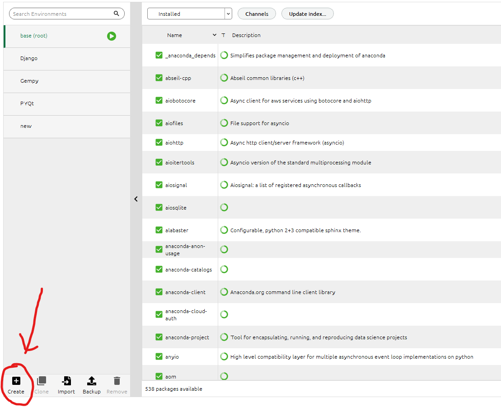

# Anaconda 管理环境的命令

author: ZH  |  date: 2023-11-29   |   category: Anaconda
**内容包含：anaconda、python包下载、conda命令、pip命令、环境配置**

## conda

### 利用conda创建一个新环境

   ```bash
   conda create --name your_env_name
   ```

其中，your_env_name 是您想要给新环境起的名称。您可以在命令后面添加 python=x.x 指定 Python 版本，例如 python=3.8。(也可以在anaconda中直接创建)

### 激活一个环境

```bash
activate your_env_name
```

### 离开（停用）当前环境

```bash
conda deactivate
```

这会将当前环境切换回基础环境。

### 其他命令

```bash
查看已安装的环境列表
conda env list
或者
conda info --envs

安装包到指定环境：
conda install -n your_env_name package_name
其中，your_env_name 是目标环境的名称，package_name 是您要安装的包的名称。

从环境中移除包：
conda remove -n your_env_name package_name
这会从指定环境中移除指定的包。

导出环境到 YAML 文件：
conda env export > environment.yml
这会将当前环境的配置导出到一个 YAML 文件中，方便与他人共享或用于重建相同环境。

创建新环境： 接收者使用以下命令创建一个新的 Conda 环境：
conda env create -f environment.yml
这将根据 YAML 文件中的规范创建一个与导出环境相同的新环境。
```

## jupter notebook配置

```bash
在当前空间内安装 ipykernel 包：
pip install ipykernel
再启动就可以啦（在对应的文件夹中打开）
jupyter notebook
```

## 字符串使用（python小技巧）

```python
使用原始字符串（Raw String）：直接从属性里复制下来，再做处理。

1、使用原始字符串，即在字符串前面加上 r 前缀，可以禁用反斜杠的转义作用。例如：
os.chdir(r'D:\桌面\NewJerseyShelf_3D_model-1.1\NewJerseyShelf_3D_model-1.1')

2、替代反斜杠：
将路径中的反斜杠替换为正斜杠（/）也是一个有效的解决方法。例如：
os.chdir('D:/桌面/NewJerseyShelf_3D_model-1.1/NewJerseyShelf_3D_model-1.1')

3、双反斜杠：
在Windows路径中，您也可以使用两个反斜杠来避免解释错误。例如：
os.chdir('D:\\桌面\\NewJerseyShelf_3D_model-1.1\\NewJerseyShelf_3D_model-1.1')

选择其中一种方法，将路径设置为适用于您的情况的格式。
```

## python下载包

```bash
下载指定版本
pip install numpy==1.19.2

删除
pip uninstall package_name

常用的pip国内镜像源：

清华大学：https://pypi.tuna.tsinghua.edu.cn/simple/
阿里云：http://mirrors.aliyun.com/pypi/simple/
中国科技大学：https://pypi.mirrors.ustc.edu.cn/simple/
豆瓣：http://pypi.douban.com/simple/

你可以在使用pip安装Python包时，通过添加-i参数指定使用其中一个镜像源，例如：

pip install 包名 -i 镜像源地址

例如，使用清华大学的镜像源安装numpy包：

pip install numpy -i https://pypi.tuna.tsinghua.edu.cn/simple/

以上命令使用清华镜像源安装 numpy 包。
显示已安装的包列表：
pip list
显示当前环境中已安装的所有包及其版本。

```

```bash
查看包的详细信息：
pip show package_name
显示指定包的详细信息，包括版本、作者等。

升级包：
pip install --upgrade package_name
将指定包升级到最新版本。

搜索包：
pip search package_name
搜索包的信息，包括名称、版本等。

导出已安装的包到文件：
pip freeze > requirements.txt
将当前环境的所有已安装包及其版本导出到文件，方便共享和重建环境。

从文件中安装依赖：
pip install -r requirements.txt
从包含依赖关系的文件中安装所有包。

```

这只是 pip 命令的一小部分，还有其他一些命令和选项可供使用。您可以使用 pip --help 来查看所有可用的选项和子命令。

## 四种不同的环境配置方法

### 要求文件 (requirements.txt)

这是一种常见的 Python 环境分享方法。通过运行 pip freeze > requirements.txt，你可以将当前环境的所有 Python 包及其版本保存到一个文本文件中。其他人可以使用 pip install -r requirements.txt 来安装相同的包。（上文中有提过）

### environment.yml 文件

Conda 的环境文件可以包含 Conda 和 pip 的依赖项，同时也可以指定操作系统级的包。（上文中也有提过）

### Docker 镜像

Docker 镜像允许你包含整个操作系统、依赖项和应用程序。这是一个更复杂的方法，适用于包含多个语言或系统级依赖项的项目。如果你的项目不仅涉及 Python 包，还依赖于其他系统级依赖项，你可以考虑将整个环境打包为 Docker 镜像。Docker 镜像可以包含操作系统、库和应用程序，确保在不同系统上的一致性。（学了以后再补充）

### 虚拟环境（Virtual Environment）

使用 Python 的 venv 或 virtualenv 创建虚拟环境，并将虚拟环境目录分享给其他人。其他人可以激活这个虚拟环境，从而在其计算机上获得相同的 Python 环境。
使用虚拟环境还是 Anaconda 环境取决于项目的需求和个人偏好。Anaconda 提供了更全面的科学计算工具和库，而虚拟环境则更轻量，适用于更通用的 Python 开发。

```bash

1在命令行中，进入项目目录。
python -m venv myenv

2激活虚拟环境：

在 Windows 上：
   myenv\Scripts\activate

在 macOS/Linux 上：
   source myenv/bin/activate

3在虚拟环境中安装项目的依赖项：
   pip install -r requirements.txt

4使用 deactivate 命令退出虚拟环境。

5压缩并分享整个虚拟环境目录（例如，使用 zip）。

其他人可以解压缩目录，并通过以下命令激活虚拟环境：
在 Windows 上：
   path\to\myenv\Scripts\activate
在 macOS/Linux 上：
   source path/to/myenv/bin/activate

```

这些方法中的选择取决于你的需求和项目的复杂性。对于简单的项目，requirements.txt 或 environment.yml 文件可能已经足够了。对于更复杂的项目，尤其是涉及多个语言或系统级依赖项的项目，Docker 镜像可能更合适。

---

[上一页](../IR/信息检索.html) | [下一页](#) | [返回主页](../../index.html)