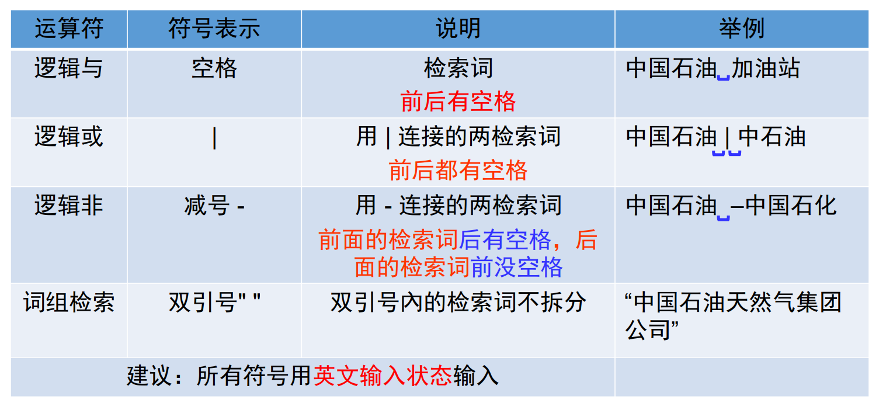

# 信息检索
author: ZH  |  date: 2023-11-25   |   category: 信息检索

## 信息搜索的逻辑

## 视频课程

### Coursera  

* <https://www.coursera.org/>
* Coursera由美国斯坦福大学两名计算机科学教授吴恩达(Andrew Ng)和达芙妮·科勒(Daphne Koller)于2012年创办。旨在同世界顶尖大学合作，在线提供免费的网络公开课程。Coursera的首批合作院校包括斯坦福大学、密歇根大学、普林斯顿大学、宾夕法尼亚大学等美国名校。目前已与275多所世界顶尖的高校和公司建立了合作。国内有北大、复旦、交大、南大、香港中文大学、香港科技大学等。
课程涉及的学科涵盖计算机、商业数据科学、生命科学、社会科学、艺术等热门学科。Coursera提供中文官方平台，运作模式是注册上课，注册时学习者可以填写中文名字，邮箱不支持QQ邮箱，可选用新浪或网易等邮箱，注册后登录方能进入课程学习。不少课程配有中文字幕。有免费课程和收费课程。学习过程包括观看课程视频、参与学习讨论、提交课程作业和穿插课程间的小测验和终极考试。付费课程提供额外的测验和项目，并在课程完成后提供可共享的课程证书。

### Udacity

* <https://www.udacity.com/>
* Udacity是前斯坦福大学教授、Google X实验室研究人员 Sebastian Thrun创办的一个国外非常先进的在线学习网站，让更多人可以免费接受高质量的教育。Udacity的课程主要是计算机科学、数学、物理、商务，并且偏重于实际应用，包括机器学习、ios及android开发。
网站提供视频(每一个视频不会超过3分钟)，在线答题、作业、期末考试、讨论区、课程学分认证，并将自己的学习成绩递交给企业。

### Metel全球高校课程资源库

* <http://www.metel.cn/>
* MeTeL全球高校课程资料库完整真实再现国外先进高校课堂教学过程及育人理念。现已收录美、英、加、澳等国400余所著名高校，2万余教师或教学小组讲授的3万余门课程、60万余课节、380万余个教学资源；
涵盖5个学科门类，62个一级学科；涉及数学、统计学、机械工程、电气工程、电子科学与技术、计算机科学与技术、化学工程与技术、地质资源与地质工程、石油与天然气工程、安全科学与工程、工商管理等，与教育部的学位授予和人才培养学科目录（2022）一致；
每门课程包括课程介绍、课程须知、课程表、教学大纲、参考教材、教材评价、任课教师等；每个课可能会有讲义、课件、音频、视频、教学图片、教学案例、阅读材料、作业、习题答案、试卷等课节资源。部分课节为独立的专题研讨会（Seminar）、实验实习、外出考察、演讲讲座、培训讲座等；个别课节会有相关的程序代码、工具软件、数据等资源。

## 考试题库

银符考试题库B12 <http://www.yfzxmn.com/>

## 专业书

* 中文专业书： 科学文库、文泉学堂
* 英文专业书：SpringerLink电子图书、 Elsevier电子图书、 Wiley电子书、 Wiley 电子教材、IOP电子图书、SEG电子书、Emerald电子书

## 论文查询

### 核心期刊

### 中文文献查阅

### 英文文献查阅

#### 全文数据库

* ScienceDirect数据库 <https://www.sciencedirect.com/>
荷兰爱思唯尔（Elsevier）出版公司创办于1880年，总部位于荷兰阿姆斯特丹，是世界上最大的医学与科学文献出版社之一。除了出版众多著名的期刊，如《The Lancet（柳叶刀）》、《Tetrahedron（四面体）》、《Cell（细胞）》外 ，还拥有众多的图书品牌，如Pergamon、Saunders、Mosby、Academic Press，以及多个有影响力的数据库产品，如Scopus、ScienceDirect、Engineering Village（EI Compendex）等

* SpringerLink数据库 <https://link.springer.com/>
德国施普林格(Springer Nature)是世界上著名的科技出版集团。SpringerLink科研平台提供学术期刊及电子图书的在线服务。数据库收录的文献涵盖24个学科，包括生物医学、工商管理、化学、计算机科学、地球科学、经济学、教育、工程、环境、地理、历史、法律、生命科学、文学、材料科学、数学、医学与公共卫生、药剂学、哲学、物理、政治学与国际关系、
心理学、社会科学、统计。

* EBSCO数据库 <http://search.epnet.com/>
EBSCO由Elton B. Stephens于1944年创立，是目前世界上最大的提供学术文献服务的专业公司之一，提供数据库、期刊、文献订购及出版等服务，总部在美国，在全球19个国家设有办事处。开发了200多个在线文献数据库产品，涉及自然科学、社会科学、生物医学、人文艺术等多学科领域。

#### 文摘数据库

* EI 工程索引数据库 <https://www.engineeringvillage.com/search/quick.url>
工程索引（Engineering Index，简称EI） 创刊于1884年，是美国工程信息公司编辑出版，现由Elsevier经营的著名工程技术类综合性检索工具。Ei Compendex 是EI的网络版，是目前全球最早最全面的工程领域的文摘数据
库，也是世界上鉴定评价科研人员、工程技术人员学术成果的权威性工具。Engineering Village平台集成了多个数据库，其中核心数据库为Ei Compendex，目前已完全包含在Scopus数据中。
* Web of Science数据库 <https://www.webofscience.com/wos/>
查影响因子：<https://jcr.clarivate.com/jcr/browse-journals>

#### 学位论文库

* 中国知网的《学位论文库》<https://kns.cnki.net/kns8?dbcode=CDMD>
* 万方《中国学位论文全文数据库》<http://c.wanfangdata.com.cn/thesis>
* CALIS 学位论文中心服务系统（文摘信息，文献传递）
✓ 检索入口： <http://etd.calis.edu.cn>
* 国家科技图书文献中心（NSTL）的学位论文库（文摘信息，文献传递）
✓ 检索入口：<http://www.nstl.gov.cn>
* 中国国家图书馆学位论文资源（文摘信息，文献传递）
✓ 资源入口： <http://www.nlc.cn/dsb_zyyfw/lw/lwzyk/（知网、万方、PQDT等）>
✓ 检索入口（博士论文）：<http://read.nlc.cn/allSearch/searchList?searchType=65&showType=1&pageNo=1>
* PQDT博硕论文全文库 <https://www.proquest.com/>

## 专利检索

### 商业数据库

CNKI中国知网
◆ 1985年至今的中国专利；1970年至今的十国两组织及两地区专利
◆ <https://kns.cnki.net/kns8?dbcode=SCOD>
万方数据（免费检索，未购买全文）
◆ 1985年至今的中国专利；1970年至今的十一国两组织及两地区专利
◆ <https://c.wanfangdata.com.cn/patent>

### 专利局官网

◆ 国家知识产权局网站 (<www.cnipa.gov.cn/>)
1985年以来的全部中国专利；国外及港澳台专利，需要注册，方能检索和下载专利全文
◆ 欧洲专利局数据库 (<http://worldwide.espacenet.com/>)
◆ 美国专利和商标局专利数据库 (<http://www.uspto.gov>)
◆ 加拿大知识产权局网站 (<http://www.ic.gc.ca/eic/site/cipointernet-internetopic.nsf/eng/Home>)
◆ 日本专利局网站 (<http://www.jpo.go.jp>)
◆ 世界知识产权组织网站 (<http://www.wipo.int/>)

### 网络上其它免费的专利数据库

◆专利之星检索系统（<http://search.patentstar.cn）>
1985年以来的中国专利，提供检索和分析功能，但分析功能需要费用，全球90多个重要国家的专利文献及相关信息，数据量超过8000万条。
◆国家重点产业专利信息服务平台（<http://chinaip.cnipa.gov.cn/）>
平台共收录了美国、日本、英国、法国、世界知识产权局、欧洲专利局等国家、地区和组织的专利文献信息，全面涵盖了十大重点产业所涉及的专利文献。
◆SooPAT专利搜索引擎（<http://www.soopat.com）>
1985年以来的中国专利（简单分析免费，高级分析收费），110个国家和地区、超过1亿6000万世界专利文献（收费）

## 会议论文

ACM美国计算机学会 <http://dl.acm.org/>
中国学术会议网（<http://conf.cnki.net）（最近召开会议征文，直播、回放）>
香山科学会议网站（ <www.xssc.ac.cn）>
高登研究会议网站（ <http://www.grc.org）(国际最近召开会议征文）>

## 标准文献的检索与利用

### 中文标准及标准文献的检索

中国标准全文库（订购，全文） <http://wfstandard.cup.edu.cn/>
万方中外标准数据库（题录信息） <https://c.wanfangdata.com.cn/standard>
CNKI标准数据总库（题录信息） <https://kns.cnki.net/kns8?dbcode=CISD>
国家科技图书文献中心标准数据库（题录，全文收费）<http://www.nstl.gov.cn>
工标网（题录，全文收费）<http://www.csres.com/>
学兔兔（原标准分享网）： <http://www.bzfxw.com/>
国家标准全文公开系统：<https://openstd.samr.gov.cn/bzgk/gb/index>

### 外文标准及标准文献的检索

IEL标准文献数据库（全文）<http://ieeexplore.ieee.org/Xplore/dynhome.jsp>
国际标准化组织（ISO）（题录信息）<http://www.iso.org>
国际电工委员会（IEC）（题录信息）<http://www.iec.ch>
Techstreet标准数据库（未订购，需购买）<http://www.techstreet.com>
国家科技文献中心标准数据库（题录，文献传递）<http://www.nstl.gov.cn>

## 著录项

## 统计数据

* 中国经济社会大数据研究平台 <https://data.cnki.net/>
* 国家统计局网站 <http://data.stats.gov.cn/>
* 全球科研项目数据库 <http://project.llas.ac.cn/>
* 百度指数（<http://index.baidu.com）>
* 联合国统计司（<http://unstats.un.org/）>
* 美国联邦储备局（FED）数据中心（<http://www.federalreserve.gov/data.htm）>
* 世界贸易组织（WTO）统计数据（<https://www.wto.org/index.htm）>
* 世界银行公开数据（<https://databank.worldbank.org/）>
* 国际货币基金组织（IMF）数据（<http://data.imf.org）>

## 
