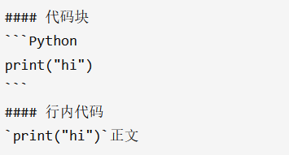

# Markdown用法（一）

author: ZH  |  date: 2023-11-25   |   category: Markdown


## 参考链接

<https://shd101wyy.github.io/markdown-preview-enhanced/#/zh-cn/markdown-basics>

## 常用的一些语法

### 标题

```Markdown
# 一级标题
## 二级标题
### 三级标题
#### 四级标题
##### 五级标题
###### 六级标题
正文
```

### 列表

```Markdown
#### 无序列表
- 1
- 2
- 3
* 1
* 2
* 3
#### 有序列表
1. 1
2. 2
3. 3
```

### 插入链接和图片

```Markdown
#### 插入链接
[Bing](/images/https://cn.bing.com)
#### 插入图片

```

### 粗体

```Markdown
**这里是粗体**
*这里是斜体*
~~这里是删除线~~
```

### 表格

```Markdown
#### 表格
| 实验组 | 时间  |   数量 |
| :----- | :---: | -----: |
| M1     |  1h   | 120000 |
| M2     |  2h   | 140000 |
| M3     |  3h   | 160000 |
```

### 代码块



### 分割线

```Markdown
#### 下面是分割线
***
#### 下面也是分割线
---
```

### 数学公式

```Markdown
#### 块内公式

$$x=\frac{-b\pm\sqrt{b^2-4ac}}{2a}$$

#### 行内公式

$x=\frac{-b\pm\sqrt{b^2-4ac}}{2a}$
```
