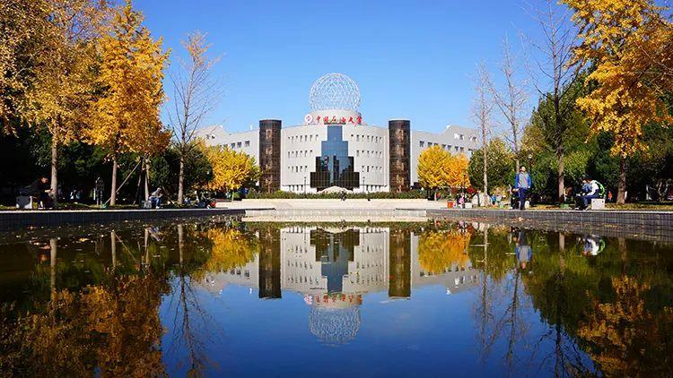

# 开发团队介绍 —— 中国石油大学（北京）理学院软件研发小组

## 我们的使命与愿景

中国石油大学（北京）理学院软件研发小组是一支由学院优秀教师和学生组成的跨学科团队，致力于利用先进的计算科学技术解决现实世界中的复杂问题，特别是在处理石油行业及其他领域的不规则、缺失数据方面，我们发挥着重要作用。我们的目标是通过创新软件工具提高数据处理效率，确保数据完整性和准确性，为科学研究和工业应用提供强有力的技术支持。

## 主要项目与成就

### 数据完整性修复与分析软件项目

我们团队专注于研发一套能够智能识别并有效填补复杂、不规则漏失数据的软件。这款软件采用先进的算法和模型，能够适应各种不同类型的数据集，尤其适用于石油勘探、开发与生产过程中的复杂数据管理难题。

### 其他正在进行的项目

- **数据可视化与智能预测平台**：该平台专为大规模数据集设计，提供灵活的可视化工具，结合机器学习算法实现对未来趋势的精准预测。

- **嵌入式数据处理系统**：针对现场实时监测设备，我们开发了一套能够在边缘计算环境中高效处理数据的嵌入式系统，显著提高了数据传输速度和分析能力。

- **科研合作项目**：与国内外多家知名企业、高校开展深度合作，共同研发服务于能源行业的专用数据处理软件包，推动产学研一体化发展。

## 开发团队特色

作为中国石油大学（北京）理学院的一员，我们充分利用学院在数学、物理、计算机科学等方面的雄厚教育资源和科研实力。团队成员具备扎实的理论基础、实践经验和创新能力，不断挑战技术边界，紧跟时代步伐，努力将学术研究成果转化为实际应用产品。

## 联系我们

若您对我们团队的项目感兴趣，希望了解更多详情或寻求潜在的合作机会，请通过电子邮件或电话联系我们：

邮箱：[zh@cup.edu.cn](mailto:zh@cup.edu.cn)
电话：+86-10-12345678 （请替换为实际联系方式）

期待与您携手共创智慧数据处理的美好未来！

---