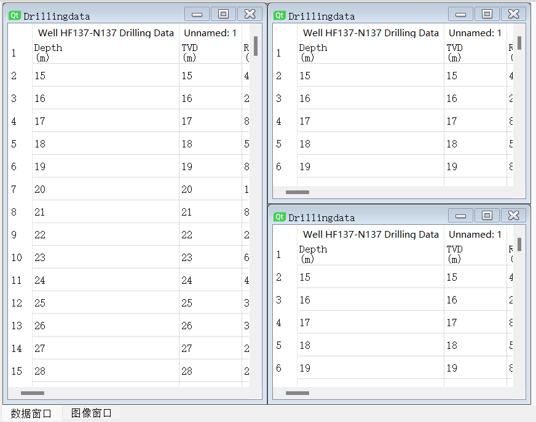

# **漏失数据处理软件** 用户手册

- [**漏失数据处理软件** 用户手册](#漏失数据处理软件-用户手册)
  - [简介](#简介)
  - [快速开始](#快速开始)
  - [主要功能模块](#主要功能模块)
    - [Excel文件导入与处理](#excel文件导入与处理)
    - [PDF数据整合](#pdf数据整合)
    - [数据合并与管理](#数据合并与管理)
    - [数据可视化](#数据可视化)
    - [工作区域管理](#工作区域管理)
  - [界面布局与功能详解](#界面布局与功能详解)
    - [显示数据区和图像区](#显示数据区和图像区)
    - [数据库数据表格展示区](#数据库数据表格展示区)
    - [工具按钮区域](#工具按钮区域)
    - [菜单栏、工具栏、状态栏](#菜单栏工具栏状态栏)
  - [操作指南](#操作指南)
    - [打开/新建工作区域](#打开新建工作区域)
    - [数据导入](#数据导入)
    - [数据合并处理](#数据合并处理)
    - [可视化](#可视化)
  - [FAQ](#faq)
    - [Q1: 如何导入Excel文件？](#q1-如何导入excel文件)
    - [Q2: 如何从PDF中提取数据？](#q2-如何从pdf中提取数据)
    - [Q3: 如何新建或打开工作区域？](#q3-如何新建或打开工作区域)

---

## 简介
**漏失数据处理软件** 是一款专门设计用于整合、管理和可视化多源钻井漏失数据的高效工具，支持Excel与PDF等多种数据格式。本手册旨在帮助用户快速上手并熟练运用该软件的各项功能。

## 快速开始
在首次使用前，请确保已安装所有必要的组件，并启动**漏失数据处理软件**。启动后，您可以通过菜单栏或主界面按钮进行文件导入、数据整理以及工作区域管理等操作。

## 主要功能模块

### Excel文件导入与处理
**漏失数据处理软件** 允许用户导入多个Excel文件，并支持对表格数据进行清洗、筛选、转换等预处理步骤。

### PDF数据整合
通过内置的PDF解析引擎，您可以提取PDF中的结构化数据并将其整合到现有的数据集中。

### 数据合并与管理
在同一平台上，您能够将来自不同源头的数据进行合并，并在统一视图下对数据集进行编辑、查询和管理。

### 数据可视化
内置丰富的图表类型，允许用户根据需求选择合适的方式展现数据，包括但不限于折线图、柱状图、饼图等，并可定制样式。

### 工作区域管理
软件支持多个独立的工作区域，每个工作区域可以保存独立的数据集和分析状态。用户可以根据项目需求自由切换、新建或关闭工作区域。最终生成的所有过程数据和结果数据都会以EXCEL或者数据库的格式自动生成在工作区域文件中。

## 界面布局与功能详解
### 显示数据区和图像区
数据显示区位于软件主界面的核心位置，直观地展示当前选定工作区域的数据内容。它支持动态刷新，并且提供了多种展示方式。

### 数据库数据表格展示区
此区域展示了从数据库加载的数据，便于用户实时监控和检索数据库内存储的信息。

### 工具按钮区域
工具按钮区域是界面的一个重要组成部分，通常位于主窗口顶部或侧面，由一系列图标按钮构成。这些按钮设计直观、操作便捷，旨在简化用户对常用功能的访问。
导入Excel：点击此按钮可以直接打开文件选择对话框，以便用户导入Excel文件并将数据加载至软件中。
PDF导入/解析：用于加载PDF文件并将其中的数据提取整合到当前工作区域。
数据合并：用于将不同来源的数据集合并在一起，形成综合的数据视图。
数据可视化：提供快速创建图表的入口，一键生成折线图、柱状图、饼图等各种图表。

### 菜单栏、工具栏、状态栏
菜单栏：位于软件窗口最顶部，包含了多个子菜单项，如“文件”、“编辑”、“查看”、“工具”、“帮助”等，每个菜单下又细分了多项具体功能。例如，“文件”菜单下就包括了新建、打开、保存、退出等操作。
示例：“文件”->“新建工作区域”用于创建全新的工作环境；“文件”->“打开工作区域”则用来重新加载之前保存的工作项目。

工具栏：紧随菜单栏下方，由一系列图标按钮组成，直观地展现了软件的主要功能，使用户可以一键直达所需操作。

状态栏：位于软件窗口底部，主要用于显示程序运行状态、提示信息或一些辅助信息，比如当前所选数据区域的状态、是否有未保存的更改、数据处理进度等。

## 操作指南
### 打开/新建工作区域
在我们的软件中，执行以下步骤以进行工作区域的管理：

新建工作区域
首先，点击顶部菜单栏中的“文件”选项。在下拉菜单中，找到并点击“新建工作区域”命令。此时，软件将自动为您创建一个干净的新工作空间，您可以开始导入数据、创建新图表或进行其他操作。或者，您也可以直接使用键盘快捷键（例如Ctrl+N），这将迅速唤起新建工作区域的功能。

打开已有工作区域
同样是在“文件”菜单下，选择“打开工作区域”选项。进入文件选择对话框，浏览并找到您之前保存的工作区域文件。选定文件后，点击“打开”，软件将加载您保存的工作区域，包括其中的数据、设置以及图形展示等内容，以便您继续之前的工作。

### 数据导入
允许用户从各种外部数据源引入数据。该功能支持多种数据格式。通过“数据导入”按钮，用户可以启动一个文件选择器或者配置数据连接，从而将选定的数据源载入到软件环境中。导入过程中，软件可能会自动识别数据结构，如列标题、数据类型，并可能提供预览以及数据清洗、转换选项，帮助用户在导入前初步整理数据质量。可支持导入"'DDR', 'FDR', 'Drillingdata'"名称的文件。
### 数据合并处理
先初步处理数据。再将三个处理后的数据集合并起来。通过合并数据，用户能够在一个统一视图下对比、关联和分析来自不同源头的信息。
### 可视化
绘制某因素与漏失之间的关系图。可视化不仅增强了数据故事的表达力，还能揭示隐藏在大量数值背后的趋势、模式和关系，从而支撑更准确的数据洞察与决策制定。

## FAQ
### Q1: 如何导入Excel文件？
进入软件主界面，点击顶部菜单栏的“文件”选项，在下拉菜单中选择“导入Excel文件”。随后在弹出的文件选择对话框中定位并选中要导入的Excel文件，点击“打开”或双击文件名即可导入。导入成功后，Excel数据将自动呈现在数据显示区内。

### Q2: 如何从PDF中提取数据？
您可以通过以下步骤从PDF文件中提取数据：
1. 点击主界面上的“PDF数据整合”功能按钮。
2. 在弹出的窗口中点击“添加PDF文件”，浏览并选择需要处理的PDF文件。
3. 软件将尝试解析并提取PDF中的结构化数据。若遇到复杂或非结构化PDF，请留意是否能准确提取，如有问题，建议先将PDF转换为更易处理的格式或联系我们的技术支持获取帮助。

### Q3: 如何新建或打开工作区域？
- 新建工作区域：在菜单栏中选择“文件” -> “新建工作区域”，或者使用相应的快捷键（如Ctrl + N），软件将在当前界面创建一个新的空白工作区域。

- 打开工作区域：同样在“文件”菜单下选择“打开工作区域”，在弹出的对话框中选择已保存的工作区域文件，点击“打开”即可恢复之前的工作环境。
---
