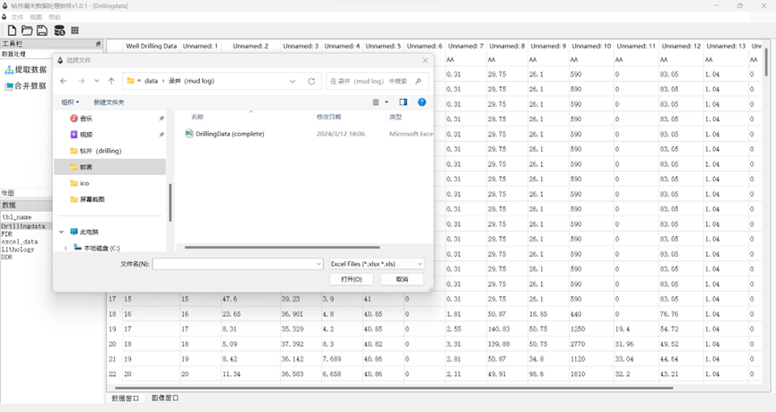
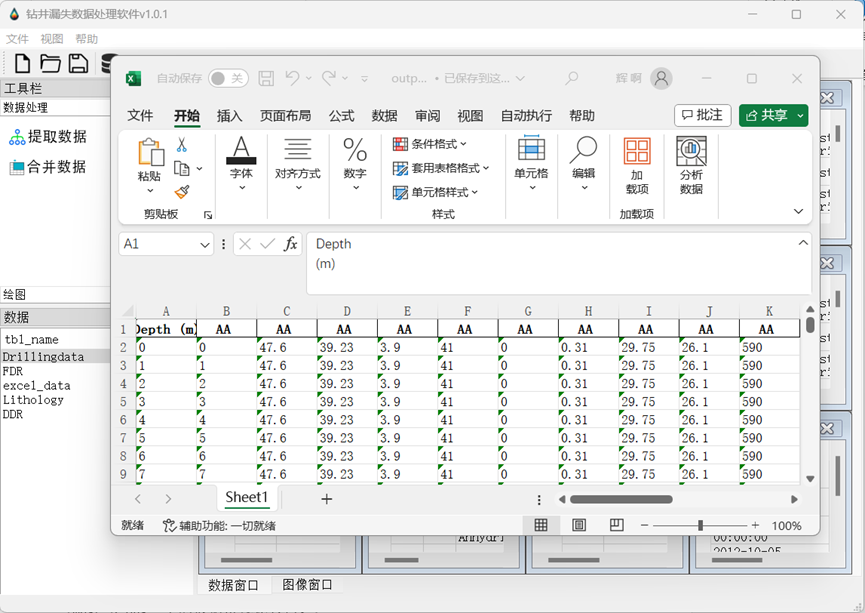
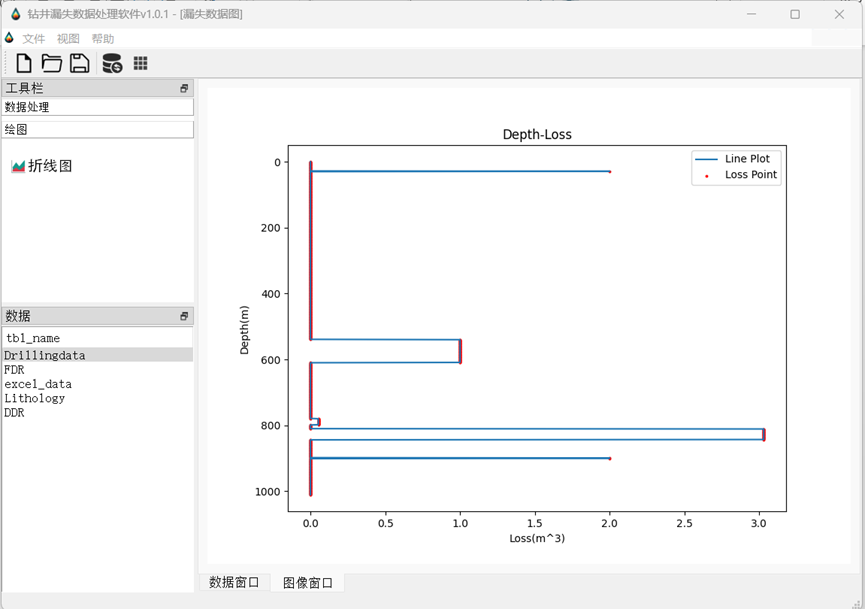

# **钻井漏失数据处理软件v1.0.1** 用户手册

- [**钻井漏失数据处理软件v1.0.1** 用户手册](#钻井漏失数据处理软件v101-用户手册)
  - [简介](#简介)
  - [快速开始](#快速开始)
  - [主要功能模块](#主要功能模块)
    - [Excel文件导入与处理](#excel文件导入与处理)
    - [PDF数据整合](#pdf数据整合)
    - [数据合并与管理](#数据合并与管理)
    - [数据可视化](#数据可视化)
    - [工作区域管理](#工作区域管理)
  - [界面布局与功能详解](#界面布局与功能详解)
    - [显示数据区和图像区](#显示数据区和图像区)
    - [数据库数据表格展示区](#数据库数据表格展示区)
    - [工具按钮区域](#工具按钮区域)
    - [菜单栏、工具栏、状态栏](#菜单栏工具栏状态栏)
  - [操作指南](#操作指南)
    - [打开/新建工作区域](#打开新建工作区域)
    - [数据导入](#数据导入)
    - [数据合并处理](#数据合并处理)
    - [可视化](#可视化)
    - [结束语](#结束语)
  - [FAQ](#faq)
    - [Q1: 如何导入Excel文件？](#q1-如何导入excel文件)
    - [Q2: 如何从PDF中提取数据？](#q2-如何从pdf中提取数据)
    - [Q3: 如何新建或打开工作区域？](#q3-如何新建或打开工作区域)

---

## 简介
钻井漏失数据处理软件是一款专业定制的应用程序，它专注于对来自不同源头和类型的钻井漏失数据（FDR\DDR\DrillingData）进行深度整合、精细化管理和高级可视化展示。这款软件的强大之处在于其高度的数据兼容性，能够无缝对接并处理Excel表格形式的详细数据记录，同时也能有效导入和解析复杂的PDF文件，极大地提升了数据处理效率和准确度。

通过使用这款软件，用户可以方便快捷地收集、整理并分析各类钻井作业过程中的漏失现象，包括但不限于漏失量、漏失时间、漏失位置等关键信息。不仅于此，软件还可以快速处理大规模数据，以协助用户快速深入挖掘数据背后的潜在规律和风险预警信号。

本用户手册详尽介绍了该钻井漏失数据处理软件的各项核心功能，从基础的数据导入、预处理到数据合并，再到直观的数据可视化呈现等环节，均提供了详细的步骤说明和操作指南，旨在帮助新老用户快速熟悉软件环境，掌握各种功能模块的具体应用方法，进而提升工作效率，优化决策流程，确保钻井作业的安全高效进行。

## 快速开始
在开始使用钻井漏失数据处理软件之前，有几个重要的初始化步骤需要确保完成，以实现顺利而高效的使用体验：

首先，请确保您的计算机系统是Window系统，目前本软件只在Window系统进行了运行测试。如果您是其他系统，可能会出现未知的异常错误。请参考软件安装包附带的安装指南或者官方网站提供的技术支持文档来逐一确认并安装。

为了方便用户使用，本软件已经被打包成可执行文件，无需安装。一旦所有必需的组件都已成功下载到位，即可正式启动钻井漏失数据处理软件。通常，只需双击安装后文件夹下的“钻井漏失处理软件v1.0.1”软件图标执行打开操作即可。启动后，您会看到友好且直观的用户界面，其中包含了丰富的功能选项和工具栏。

无论您是初次接触还是已经具有一定使用经验的用户，遵循以上指引，都可以迅速投入到钻井漏失数据的处理工作中，充分利用软件所提供的强大功能，以科学的方法解决实际问题，提高生产效率并保障钻井工程的安全性能。

## 主要功能模块

### Excel文件导入与处理
漏失数据处理软件具备强大的数据导入能力，能够便捷高效地将大体积的Excel文件依次导入至系统中。导入过程中，软件提供了自动的数据预处理功能，根据地质研究的学科知识和要求自动化对表格数据执行一系列必要的清洗、筛选和转换任务。比如，可以自动去除重复行、填充或删除缺失值、转换数据格式，还可以根据特定规则对数据进行排序、过滤或应用计算公式，以确保数据准确性和完整性。同时由于工程数据复杂、数据量大，所以会导致提取过程耗时长。本软件采取多线程的方式，可以同时提取多个文件，且提取文件的过程中可以使用其他功能，大大节省了用户的时间和精力。

### PDF数据整合
利用先进的内置PDF解析引擎，该软件能够智能抓取并解析PDF文档中的结构化数据，将其转化为可供进一步分析使用的格式。这一功能极大地扩展了数据来源，用户无需手动转录，即可将PDF中的关键信息无缝整合到现有漏失数据集中，增强了数据综合分析的能力。

### 数据合并与管理
在同一集成化的平台上，软件允许用户将来自不同设备、不同时间段、不同格式的数据源进行合并。通过灵活的数据管理工具，不仅能够在统一的视图下对合并后的数据集进行深度编辑和精细化查询，还支持按照自定义标准对数据进行分组、归类和标签管理，方便用户快速定位所需信息。将导入的数据都储存成数据库格式，用户可以点击数据表的名称在数据窗口生成可视化的表格，修改数值，查看数值。后续也可以将文件导入到其他设备，同其他软件中再处理。

### 数据可视化
软件内置了图表工具，满足用户对数据可视化展示的各种需求。无论是动态趋势分析所需的折线图、还是比较分析时常用的散点图，均可根据用户的实际需绘画，在图像窗口展示，以便更直观地揭示数据背后的规律和价值。

### 工作区域管理
设计者充分考虑到了多任务并行处理的需求，软件支持创建和管理多个独立的工作区域。每个工作区域相当于一个独立的工作空间，可以存储和维护不同的数据集及其对应的分析状态。用户可以根据项目特点或个人习惯自由地新建、切换和关闭工作区域，同时保持各区域间互不干扰。在分析完成后，所有经过处理的过程数据和得出的结果数据以及图像都能够被自动保存和组织，支持导出为Excel表格形式或直接保存至数据库中，便于数据备份和后续复用。如图，展示了某一个工作区，用户可以更加直观地了解软件的工作区域布局及其管理功能的实际操作效果。

## 界面布局与功能详解
### 显示数据区和图像区
数据显示区就是数据窗口。数据窗口里有很多子窗口展示数据表格。作为软件的核心交互区域，占据了界面的重要位置，其主要功能在于实时、直观地呈现当前用户所选定工作范围内的数据内容。这一区域具备动态刷新特性，能够随着数据的变化自动更新，从而确保用户始终获得最新、最准确的信息。数据显示的方式灵活多样，可以根据需要调整为列表视图、平铺视图等多种形式还可以全屏显示，修改数据。

### 数据库数据表格展示区
该区域专为高效管理和查询数据库内容而设计，用于清晰展示从后台数据库加载的各项数据记录。用户在此区域内能够实现对数据库内存储信息的展示，导入的数据经过处理后就会被存储成数据库的格式，并在此区域展示表名。点击数据库数据表格展示区的表名就可以在右侧的数据窗口里展示数据。比如此时点击了“Drillingdata”就可以看到右侧的数据窗口展示了处理后的Drillingdata数据。

### 工具按钮区域
工具按钮区域是软件界面不可或缺的一部分，位于主窗口的顶部左侧边，集成了一系列图标化的快捷按钮。这些按钮不仅设计简洁明了，易于辨识，还致力于简化用户的操作流程，使得高频功能的访问更为方便快捷。其中包括但不限于以下功能按钮：

提取数据：用户只需点击此按钮，系统即会弹出文件选择对话框，允许用户选取并导入Excel文件或者PDF文件（数据名称以及格式要求见安装包中的示例数据），软件会智能解析并抽取文档中的数据，将其整合到当前的工作环境中，随后软件将自动读取并加载数据到相应的数据展示区域，数据提取成功会提醒用户点击刷新数据按钮。

数据合并：为了满足多源数据融合的需求，软件提供数据合并功能，用户可将不同来源的数据集无缝拼接在一起，形成一个综合全面的数据视图。并且最终会生成一个适合工程使用的综合数据表output.xlsx。合并完成后就会自动弹出。

数据可视化：为了让数据更生动、直观，软件内置了一键生成深度与漏失量的图表的功能，帮助用户快速进行数据分析与汇报，生成之后会提醒用户点击图片窗口查看。

### 菜单栏、工具栏、状态栏
菜单栏：作为界面顶部的标准元素，菜单栏囊括了软件的主要操作类别，如“文件”、“视图”、“帮助”。每个大类下又进一步细分为多个具体的子功能项。例如，在“文件”菜单中，用户可以执行诸如“新建工作区域”以创建空白的工作环境，或是“打开工作区域”来重新加载先前保存的工作项目，以及其他如保存、关闭、导出等常规文件操作。在“视图”菜单中，用户可以删除数据表格、平铺数据表格、堆叠数据表格。在“帮助”菜单中，用户可以打开用户手册、关于我们、隐私政策。

工具栏：紧随菜单栏之下，工具栏同样承载着重要的快捷功能入口，通过一组图标按钮直观展现软件的主要功能模块。用户无需深入菜单层级，即可通过单击按钮直接执行相应操作，极大地提升了工作效率。每提取一次数据就需要手动点击菜单栏的更新数据按钮。

状态栏：界面的底部是状态栏所在的位置，它是反馈软件运行状态、提示信息及辅助信息的关键区域。状态栏可能显示的内容包括但不限于当前所选工作区域的绝对位置、菜单按钮的名称提醒、正在进行的数据处理进度提醒等，确保用户随时掌握软件运行状况以及数据处理进程。
同时，工具栏、工具按钮栏等都可以随意改变位置以及大小，便于用户个性化修改。
## 操作指南
### 打开/新建工作区域
在我们的漏失数据处理软件中，对于工作区域的管理以及数据导入、处理与可视化的具体操作步骤如下：

新建工作区域：要创建一个新的工作空间，首先，请在软件顶部菜单栏点击“文件”按钮。下拉菜单展开后，您会看到一个名为“新建工作区域”的选项。单击此选项，软件将立即为您生成一个空白的工作区域，您可以在这里开始从零构建您的数据分析项目，包括导入数据、设计图表和执行其他各种分析任务。为了提高效率，还可以利用键盘快捷键Ctrl+N来快速启动新建工作区域的功能。

打开已有工作区域：如果需要继续之前保存的工作，同样通过顶部菜单栏选择“文件”，然后在下拉列表中选择“打开工作区域”。系统将会弹出一个文件选择对话框，在这里浏览并定位到您之前保存的工作区域文件。选定目标文件后，点击“打开”按钮，软件将加载该工作区域及其所有相关的内容，如已导入的数据集、自定义设置及已经创建的各种图表展示等。

### 数据导入
为了整合外部数据源，本软件支持多种数据格式的灵活导入。只需点击界面上的“数据提取”按钮或相应菜单项，即可启动文件浏览器或者配置数据连接界面。无论是Excel表格、PDF文件（特定的行业标准数据DDR、FDR或Drillingdata），用户都可以轻松地将其载入至软件环境中。在导入过程中，软件通常能够智能识别数据结构，自动匹配列标题、检测数据类型，并提供预览功能。此外，还包含了实用的数据清洗和转换工具，用户可在导入前对数据进行初步整理和优化，以确保后续分析的准确性和可靠性。
### 数据合并处理
在完成单个数据集的初步处理之后，可以将它们合并为一个统一的数据视图。这一过程允许用户将来自不同来源但具有关联性的数据集整合在一起，以便在同一平台上对比分析、建立关联性以及深入挖掘隐藏在交叉数据中的信息价值。注意：必须先提取数据再合并数据，然后再生成图像。否则会提醒用户。
### 可视化
若要揭示变量之间的关系，比如深度与漏失率之间的关联，可利用软件强大的数据可视化功能。通过选择适当的图表类型（例如折线图、散点图），可以生动形象地展现这些复杂关系。如附图所示，直观的图形表达不仅强化了数据背后的故事叙述能力，更能帮助发现那些隐藏在海量数值背后的趋势、模式和关键联系，从而支撑更为精确的数据洞察与决策制定过程。点击菜单栏的保存按钮或者快捷键Ctrl+S可以保存生成的图像到工作区。

### 结束语
至此，本用户手册已详尽地为您介绍了工作区域管理、数据导入与处理以及可视化分析等功能的详细操作流程。我们希望这份指南能帮助您高效地掌握软件的各项核心功能，并在实际应用中得心应手。从新建和打开工作区域，到灵活运用数据合并与深度分析工具，再到利用可视化手段洞察业务关键信息，每一个步骤都是为了助力您的决策更加科学准确。

感谢您耐心阅读至本手册的结尾，如果您在使用过程中有任何疑问或需要进一步的帮助，请随时查阅相关支持文档或联系我们的客户服务团队。愿您的数据分析之旅因我们的软件而更富成效，期待您在此基础上不断探索、创新并取得丰硕成果。再次感谢您的选择，敬请期待我们的软件未来更多的优化与更新！

## FAQ
### Q1: 如何导入Excel文件？
进入软件主界面，点击顶部菜单栏的“文件”选项，在下拉菜单中选择“导入Excel文件”。随后在弹出的文件选择对话框中定位并选中要导入的Excel文件，点击“打开”或双击文件名即可导入。导入成功后，Excel数据将自动呈现在数据显示区内。

### Q2: 如何从PDF中提取数据？
您可以通过以下步骤从PDF文件中提取数据：
1. 点击主界面上的“PDF数据整合”功能按钮。
2. 在弹出的窗口中点击“添加PDF文件”，浏览并选择需要处理的PDF文件。
3. 软件将尝试解析并提取PDF中的结构化数据。若遇到复杂或非结构化PDF，请留意是否能准确提取，如有问题，建议先将PDF转换为更易处理的格式或联系我们的技术支持获取帮助。

### Q3: 如何新建或打开工作区域？
- 新建工作区域：在菜单栏中选择“文件” -> “新建工作区域”，或者使用相应的快捷键（如Ctrl + N），软件将在当前界面创建一个新的空白工作区域。

- 打开工作区域：同样在“文件”菜单下选择“打开工作区域”，在弹出的对话框中选择已保存的工作区域文件，点击“打开”即可恢复之前的工作环境。
---
